# Modèle Attack Tree - Phase de Planification

## Aperçu

### Objectif

Les arbres d'attaque fournissent une représentation visuelle et hiérarchique de la façon dont un attaquant pourrait atteindre un objectif spécifique. Ils aident les équipes de sécurité à :

- Identifier les chemins d'attaque
- Comprendre la complexité des attaques
- Prioriser les défenses en fonction de la probabilité d'attaque
- Communiquer les menaces aux parties prenantes

### Quand utiliser

- Phase de planification avant conception détaillée
- Revues d'architecture de sécurité
- Préparation de tests d'intrusion
- Exercices d'évaluation des risques

### Qui devrait utiliser

- Architectes de sécurité
- Équipes de modélisation des menaces
- Testeurs d'intrusion
- Analystes de risques

## Instructions

1. **Définir l'objectif d'attaque** : Choisir un objectif d'attaquant spécifique
2. **Identifier les chemins d'attaque** : Décomposer comment l'objectif pourrait être atteint
3. **Construire l'arbre** : Créer une structure hiérarchique (racine = objectif, feuilles = vecteurs d'attaque)
4. **Annoter les nœuds** : Ajouter difficulté, coût, détectabilité
5. **Analyser les chemins** : Identifier les chemins les plus probables/dangereux
6. **Prioriser les défenses** : Se concentrer sur les nœuds critiques

---

## 1. Définition de l'objectif d'attaque

### Objectif d'attaque principal

**Objectif** : [ex : "Accès non autorisé à la base de données clients"]

**Valeur pour l'attaquant** : [Pourquoi l'attaquant poursuivrait-il ceci ? ex : "Voler les données personnelles clients pour vente sur dark web"]

**Impact si atteint** : [Impact business/sécurité, ex : "Critique - Violation RGPD, dommage de réputation, perte financière"]

---

## 2. Structure de l'arbre d'attaque

### Notation de l'arbre

```
Nœuds AND : Tous les enfants doivent réussir (représentés avec &)
Nœuds OR : N'importe quel enfant peut réussir (représentés avec |)
```

### Diagramme de l'arbre d'attaque

```mermaid
graph TD
    %% --- Objectif Racine ---
    Root("🔴 OBJECTIF :<br>Accès non autorisé<br>BDD Clients")

    %% --- Niveau 1 : Vecteurs principaux (OR implicite) ---
    Physical("🏢 OR : Accès physique<br>Centre de données")
    Network("🌐 OR : Attaque réseau")
    Supply("📦 OR : Attaque<br>Supply Chain")

    Root --> Physical
    Root --> Network
    Root --> Supply

    %% --- Branche Physique ---
    BypassSec("🔒 AND : Contourner<br>sécurité physique")
    Insider("👤 Menace interne<br>(Employé malveillant)")

    Physical --> BypassSec
    Physical --> Insider

    %% Feuilles Physique
    SocialEng["Ingénierie sociale<br>(Faux technicien)"]
    BreakAccess["Vaincre contrôles d'accès<br>(Badge volé)"]
    
    BypassSec --> SocialEng
    BypassSec --> BreakAccess

    %% --- Branche Réseau ---
    SQLi("💉 AND : Injection SQL")
    CredStuff("🔑 AND : Credential<br>Stuffing")
    ApiVuln("🔌 AND : Vulnérabilité<br>API")

    Network --> SQLi
    Network --> CredStuff
    Network --> ApiVuln

    %% Feuilles Réseau
    SQLi --> FindEnd["Trouver endpoint<br>vulnérable"]
    SQLi --> Payload["Créer payload<br>d'exploitation"]

    CredStuff --> GetList["Obtenir liste<br>identifiants"]
    CredStuff --> AutoTry["Tentatives<br>automatisées"]
    CredStuff --> BypassRate["Contourner<br>Rate Limiting"]

    ApiVuln --> FindApi["Découvrir endpoint<br>non authentifié"]
    ApiVuln --> Exfil["Exfiltrer données"]

    %% --- Branche Supply Chain ---
    LibComp("📚 AND : Compromettre<br>librairie tierce")
    CloudComp("☁️ AND : Compromettre<br>compte Cloud")

    Supply --> LibComp
    Supply --> CloudComp

    %% Feuilles Supply Chain
    LibComp --> Inject["Injecter code<br>malveillant"]
    LibComp --> Wait["Attendre le<br>déploiement"]

    CloudComp --> Phishing["Phishing Admin<br>Cloud"]
    CloudComp --> Console["Accès BDD via<br>Console"]

    %% --- Styles ---
    classDef root fill:#ffcdd2,stroke:#c62828,stroke-width:2px,color:black;
    classDef vector fill:#e1f5fe,stroke:#0277bd,stroke-width:2px,color:black;
    classDef logic fill:#fff9c4,stroke:#fbc02d,stroke-width:2px,color:black;
    classDef action fill:#f5f5f5,stroke:#616161,stroke-width:1px,color:black;

    class Root root;
    class Physical,Network,Supply vector;
    class BypassSec,SQLi,CredStuff,ApiVuln,LibComp,CloudComp logic;
    class Insider,SocialEng,BreakAccess,FindEnd,Payload,GetList,AutoTry,BypassRate,FindApi,Exfil,Inject,Wait,Phishing,Console action;
```



---

## 3. Analyse des chemins d'attaque

### Chemin 1 : Injection SQL → Accès base de données

| Étape d'attaque | Type | Difficulté | Coût | Détectabilité | Contrôles existants | Lacunes |
|-----------------|------|------------|------|---------------|---------------------|---------|
| Trouver endpoint vulnérable | Feuille | Moyenne | Faible | Faible | Analyse DAST | Couverture incomplète |
| Créer payload d'exploitation | Feuille | Moyenne | Faible | Moyenne | WAF, Validation d'entrée | Contournement WAF possible |
| **Chemin global** | - | **Moyenne** | **Faible** | **Moyenne** | Partiel | **PRIORITÉ ÉLEVÉE** |

**Contre-mesures** :

- Requêtes paramétrées/prepared statements
- Validation et assainissement d'entrée
- WAF avec règles mises à jour
- Analyse DAST et SAST régulière
- Comptes de base de données à moindre privilège

---

### Chemin 2 : Credential stuffing → Accès base de données

| Étape d'attaque | Type | Difficulté | Coût | Détectabilité | Contrôles existants | Lacunes |
|-----------------|------|------------|------|---------------|---------------------|---------|
| Obtenir identifiants divulgués | Feuille | Faible | Faible | N/A | Aucun | Pas de surveillance |
| Tentatives de connexion automatisées | Feuille | Faible | Faible | Élevée | Rate limiting basique | Peut être contourné |
| Contourner rate limiting | Feuille | Moyenne | Faible | Moyenne | Limitation par IP | IPs distribuées |
| **Chemin global** | - | **Moyenne** | **Faible** | **Élevée** | Faible | **PRIORITÉ MOYENNE** |

**Contre-mesures** :

- Authentification multi-facteurs (MFA)
- Surveillance de fuites d'identifiants
- Rate limiting avancé (basé compte, comportemental)
- CAPTCHA pour échecs répétés
- Politiques de verrouillage de compte

---

### Chemin 3 : Accès physique → Accès base de données

| Étape d'attaque | Type | Difficulté | Coût | Détectabilité | Contrôles existants | Lacunes |
|-----------------|------|------------|------|---------------|---------------------|---------|
| Ingénierie sociale | Feuille | Élevée | Faible | Moyenne | Formation sensibilisation sécurité | Tout le personnel non formé |
| Vaincre contrôles d'accès | Feuille | Élevée | Moyenne | Élevée | Accès par badge, caméras | Tailgating possible |
| **Chemin global** | - | **Élevée** | **Moyenne** | **Élevée** | Fort | **PRIORITÉ FAIBLE** |

**Contre-mesures** :

- Formation régulière de sensibilisation à la sécurité
- Politiques strictes de visiteurs
- Entrées mantrap/tourniquets
- Présence de gardiens de sécurité

---

### Chemin 4 : [Chemin d'attaque supplémentaire]

| Étape d'attaque | Type | Difficulté | Coût | Détectabilité | Contrôles existants | Lacunes |
|-----------------|------|------------|------|---------------|---------------------|---------|
| [Étape 1] | Feuille | [Faible/Moyenne/Élevée] | [Faible/Moyenne/Élevée] | [Faible/Moyenne/Élevée] | [Contrôles] | [Lacunes] |
| [Étape 2] | Feuille | [Faible/Moyenne/Élevée] | [Faible/Moyenne/Élevée] | [Faible/Moyenne/Élevée] | [Contrôles] | [Lacunes] |
| **Chemin global** | - | **[Difficulté]** | **[Coût]** | **[Détectabilité]** | [Fort/Faible/Aucun] | **[PRIORITÉ]** |

**Contre-mesures** :

- [Atténuation 1]
- [Atténuation 2]

---

## 4. Priorisation des chemins d'attaque

### Matrice de priorité

| Priorité | Chemin d'attaque | Score de risque | Justification |
|----------|-----------------|-----------------|---------------|
| **P0 - Critique** | Injection SQL | 18/20 | Difficulté faible, impact élevé, lacunes connues dans contrôles |
| **P1 - Élevé** | Credential stuffing | 14/20 | Difficulté faible, adoption MFA faible |
| **P2 - Moyen** | Vulnérabilité API | 12/20 | Difficulté moyenne, contrôles modérés |
| **P3 - Faible** | Accès physique | 6/20 | Difficulté élevée, contrôles existants forts |
| **P3 - Faible** | Supply chain | 8/20 | Difficulté très élevée, occurrence rare |

**Notation de risque** : (21 - Difficulté) × (Impact / 5) × (Lacunes / 5)

- Difficulté : 1 (plus facile) à 20 (plus difficile)
- Impact : échelle 1-5
- Lacunes : 1 (pas de lacunes) à 5 (lacunes majeures)

---

## 5. Recommandations de défense

### Actions immédiates (P0-P1)

1. **Atténuation injection SQL**
   - Propriétaire : Équipe Ingénierie
   - Échéance : Sprint +2
   - Actions :
     - Audit de code pour requêtes paramétrées
     - Activer SAST dans pipeline CI/CD
     - Déployer règles WAF mises à jour
     - Revue des privilèges comptes base de données

2. **Atténuation credential stuffing**
   - Propriétaire : Équipe sécurité
   - Échéance : Sprint +3
   - Actions :
     - Imposer MFA pour tous les utilisateurs
     - Implémenter rate limiting basé compte
     - Déployer surveillance de fuites d'identifiants
     - Ajouter CAPTCHA pour connexion

### Initiatives stratégiques (P2-P3)

3. **Renforcement sécurité API**
   - Propriétaire : Équipe Plateforme
   - Calendrier : T1 2025
   - Actions :
     - Audit de sécurité API
     - Implémenter authentification API pour tous les endpoints
     - Ajouter rate limiting et surveillance API

4. **Sécurité supply chain**
   - Propriétaire : Équipe DevOps
   - Calendrier : T2 2025
   - Actions :
     - Analyse de composition logicielle (SCA)
     - Évaluations de sécurité fournisseurs
     - Renforcement sécurité fournisseur cloud

---

## 6. Liste de vérification

- [ ] Objectif d'attaque clairement défini
- [ ] Tous les chemins d'attaque majeurs identifiés
- [ ] Structure arbre utilise logique AND/OR appropriée
- [ ] Chaque chemin analysé pour difficulté, coût, détectabilité
- [ ] Contrôles existants documentés
- [ ] Lacunes identifiées
- [ ] Chemins priorisés par risque
- [ ] Contre-mesures identifiées pour chemins hautement prioritaires
- [ ] Propriétaires et échéances assignés
- [ ] Revue par champion de sécurité complétée

---

## 7. Revue et maintenance

### Historique des revues

| Version | Date | Réviseur | Modifications |
|---------|------|----------|---------------|
| 1.0 | 2025-01-15 | [Nom] | Arbre d'attaque initial |

### Prochaine revue

**Planifiée** : [Trimestrielle ou lorsque le système change significativement]

**Déclencheurs** :

- Nouvelles fonctionnalités ajoutées
- Changements d'architecture
- Nouvelles techniques d'attaque découvertes
- Incidents de sécurité

---

## Ressources liées

- [Modèle de Menaces STRIDE](stride-threat-model-template-planning.md)
- [Modèle de Notation de Risques](../02-risk-analysis/risk-scoring-template-planning.md)
- [Schneier on Attack Trees](https://www.schneier.com/academic/archives/1999/12/attack_trees.html)
