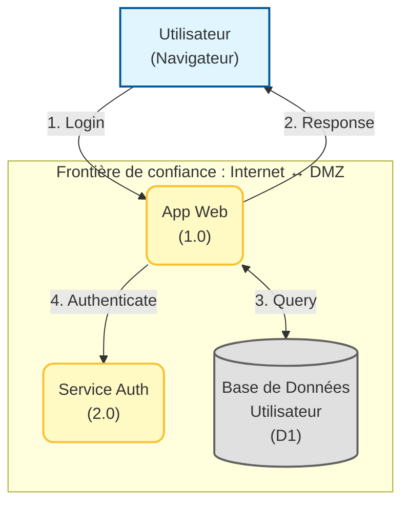
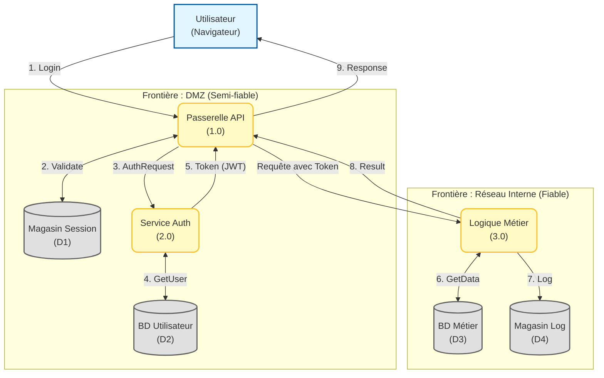

# Modèle Diagramme de Flux de Données - Phase de Conception

## Aperçu

### Objectif

Un diagramme de flux de données (DFD) visualise comment les données se déplacent à travers votre système, montrant :
- **Processus** : Composants système qui transforment les données
- **Magasins de Données** : Où les données sont stockées
- **Entités Externes** : Utilisateurs, systèmes externes
- **Flux de Données** : Comment les données se déplacent entre les éléments
- **Frontières de Confiance** : Franchissements de périmètre de sécurité

Les DFD sont essentiels pour la modélisation des menaces, spécialement l'analyse STRIDE.

### Quand utiliser

- Phase de conception lorsque l'architecture est définie
- Avant la modélisation des menaces STRIDE
- Revues d'architecture de sécurité
- Évaluations d'impact sur la vie privée

### Qui devrait utiliser

- Architectes système
- Architectes de sécurité
- Développeurs
- Champions de sécurité

---

## 1. Référence des éléments DFD

### Notation standard

```
┌─────────────┐
│  Entité     │  = Entité externe (utilisateur, système externe)
│  externe    │
└─────────────┘

┌──────────┐
│ Processus│     = Processus (application, service, composant)
│  (1.0)   │
└──────────┘

║ Magasin  ║
║ données  ║     = Magasin de données (base de données, fichier, cache)
║  (D1)    ║

────────────>    = Flux de données (indique la direction)

- - - - - - -    = Frontière de confiance (périmètre de sécurité)
```

---

## 2. Diagramme de contexte système (niveau 0)

### Diagramme



**Description** : Vue de haut niveau montrant le système principal et les entités externes.

---

## 3. Diagramme de flux de données détaillé (niveau 1)

### Diagramme



**Descriptions des flux de données** :

| Flux # | De | Vers | Données | Protocole | Chiffrement | Authentification |
|--------|------|-----|----|----------|------------|----------------|
| 1 | Utilisateur | Passerelle API | Nom d'utilisateur, Mot de passe | HTTPS | TLS 1.3 | Aucune (initiale) |
| 2 | Passerelle API | Magasin Session | Jeton Session | Interne | Aucun | Basé jeton |
| 3 | Passerelle API | Service Auth | Requête Auth | gRPC | mTLS | Clé API |
| 4 | Service Auth | BD Utilisateur | Requête Utilisateur | PostgreSQL | TLS | Identifiants BD |
| 5 | Service Auth | Passerelle API | Jeton JWT | gRPC | mTLS | JWT Signé |
| 6 | Logique Métier | BD Métier | Requête SQL | PostgreSQL | TLS | Identifiants BD |
| 7 | Logique Métier | Magasin Log | Log Audit | HTTP | TLS | Clé API |
| 8 | Logique Métier | Passerelle API | Réponse JSON | gRPC | mTLS | JWT |
| 9 | Passerelle API | Utilisateur | Réponse HTTP | HTTPS | TLS 1.3 | Cookie Session |

---

## 4. Frontières de confiance

### Frontière de confiance 1 : Internet ↔ DMZ

**Niveau de menace** : Non fiable → Semi-fiable

**Contrôles de sécurité** :
- [ ] Web Application Firewall (WAF)
- [ ] Protection DDoS
- [ ] Chiffrement TLS (HTTPS)
- [ ] Validation d'entrée
- [ ] Rate limiting
- [ ] CAPTCHA pour actions sensibles

**Classification des données** : Public, Interne, Confidentiel (chiffré)

---

### Frontière de confiance 2 : DMZ ↔ Réseau interne

**Niveau de menace** : Semi-fiable → Fiable

**Contrôles de sécurité** :
- [ ] Segmentation réseau (VLANs, sous-réseaux)
- [ ] TLS mutuel (mTLS) pour communication inter-services
- [ ] Authentification et autorisation API
- [ ] Journalisation d'audit pour tous les accès
- [ ] Système de détection d'intrusion (IDS)

**Classification des données** : Interne, Confidentiel

---

### Frontière de confiance 3 : Application ↔ Base de données

**Niveau de menace** : Fiable → Hautement fiable

**Contrôles de sécurité** :
- [ ] Authentification base de données
- [ ] Comptes base de données à moindre privilège
- [ ] Connexions chiffrées (TLS)
- [ ] Requêtes paramétrées (pas d'injection SQL)
- [ ] Journalisation d'audit base de données
- [ ] Isolation réseau (sous-réseau privé)

**Classification des données** : Confidentiel, Secret (PII, identifiants)

---

## 5. Inventaire des magasins de données

| ID magasin | Nom | Type | Classification données | Chiffrement au repos | Sauvegarde | Rétention |
|---------------|------|------|---------------------|-------------------|--------|-----------|
| D1 | Magasin session | Redis | Interne | Non (éphémère) | Non | 24 heures |
| D2 | Base données utilisateur | PostgreSQL | Confidentiel | Oui (AES-256) | Quotidienne | 7 ans |
| D3 | Base données métier | PostgreSQL | Interne | Oui (AES-256) | Quotidienne | 5 ans |
| D4 | Magasin log | Elasticsearch | Interne | Oui | Quotidienne | 90 jours |
| D5 | [Nom magasin] | [Type] | [Classification] | [Oui/Non] | [Fréquence] | [Période] |

---

## 6. Entités externes

| Entité | Type | Niveau confiance | Méthode authentification | Autorisation | Données partagées |
|--------|------|-------------|----------------------|---------------|-------------|
| Utilisateur (navigateur) | Humain | Non fiable | Nom d'utilisateur/Mot de passe + MFA | Basée rôle | Profil utilisateur, jeton session |
| Passerelle paiement | API tierce | Semi-fiable | Clé API + OAuth | Jetons scopés | Infos paiement (tokenisées) |
| Service email | SaaS tierce | Semi-fiable | Clé API | Scopes API | Adresses email, contenu notification |
| Portail admin | Outil interne | Fiable | SSO (SAML) | Rôles admin | Toutes données (lecture/écriture) |

---

## 7. Détails des processus

### Processus 1.0 : Passerelle API

**Description** : Point d'entrée pour toutes les requêtes externes

**Entrées** :
- Requêtes d'authentification utilisateur (HTTPS)
- Requêtes logique métier (HTTPS)

**Sorties** :
- Réponses HTTP vers utilisateurs
- Requêtes Auth vers Service Auth
- Requêtes Métier vers Logique Métier

**Contrôles de sécurité** :
- Rate limiting
- Validation d'entrée
- Journalisation de requêtes
- Politiques CORS
- Protection CSRF

**Menaces** :
- Attaques DDoS
- Injection d'entrée
- Accès non autorisé

---

### Processus 2.0 : Service auth

**Description** : Gère l'authentification et l'autorisation

**Entrées** :
- Requêtes d'authentification de passerelle API
- Identifiants utilisateur de BD utilisateur

**Sorties** :
- Jetons JWT vers passerelle API
- Logs audit vers magasin log

**Contrôles de sécurité** :
- Hachage mot de passe (bcrypt)
- Vérification MFA
- Politiques de verrouillage compte
- Gestion de session

**Menaces** :
- Credential stuffing
- Attaques force brute
- Détournement de session

---

### Processus 3.0 : Logique métier

**Description** : Logique applicative de base

**Entrées** :
- Requêtes authentifiées de passerelle API
- Données de BD métier

**Sorties** :
- Réponses métier vers passerelle API
- Logs audit vers magasin log

**Contrôles de sécurité** :
- Vérifications d'autorisation (RBAC)
- Validation d'entrée
- Assainissement de sortie
- Journalisation d'audit

**Menaces** :
- Contournement d'autorisation
- Failles logique métier
- Fuite de données

---

## 8. Liste de vérification

- [ ] Tous les processus identifiés et documentés
- [ ] Tous les magasins de données identifiés avec classification
- [ ] Toutes les entités externes listées
- [ ] Tous les flux de données documentés avec protocoles
- [ ] Frontières de confiance clairement marquées
- [ ] Contrôles de sécurité documentés par frontière
- [ ] Exigences de chiffrement des données spécifiées
- [ ] Méthodes d'authentification et autorisation notées
- [ ] Diagramme revu par champion de sécurité
- [ ] DFD utilisé comme entrée pour modèle menaces STRIDE

---

## 9. Ressources liées

- [Modèle de Menaces STRIDE](stride-threat-model-template-planning.md)
- [Microsoft Threat Modeling Tool](https://aka.ms/threatmodelingtool)
- [OWASP Threat Modeling](https://owasp.org/www-community/Threat_Modeling)
