# Modèle de menaces STRIDE

## 1. Périmètre et architecture

### Description du système

**Nom** : [Nom du système]
**Objectif** : [À quoi sert ce système ? Ex: API de paiement, Portail client...]

### Diagramme de flux de données (DFD)

*Remplacer ce bloc par votre code Mermaid (copié du template DFD).*

```mermaid
graph TD
    %% Exemple de placeholder
    User[Utilisateur] -- HTTPS --> API[API Gateway]
    API -- Query --> DB[(Base de Données)]
    
    subgraph "Trust Boundary"
    API
    DB
    end
```

## 2. Checklist des vulnérabilités standards

*Ne perdez pas de temps à réécrire les menaces génériques. Cochez simplement si elles sont applicables et traitées.*
*Référence : [stride-threat-library-common.md](stride-threat-library-common.md)*

### S - Spoofing & T - Tampering

- [ ] **VULN-S01** : Authentification manquante ou faible sur les endpoints ?
- [ ] **VULN-S02** : Gestion de session (cookies/token) non sécurisée ?
- [ ] **VULN-T01** : Transport non chiffré (absence de TLS/HTTPS) ?
- [ ] **VULN-T02** : Absence de protection CSRF sur les mutations (POST/PUT/DELETE) ?

### R - Repudiation & I - Information Disclosure

- [ ] **VULN-R01** : Logs d'audit insuffisants ou absents pour les actions critiques ?
- [ ] **VULN-I01** : Secrets (clés API, mots de passe) codés en dur ou dans la config ?
- [ ] **VULN-I02** : Messages d'erreurs techniques trop verbeux exposés à l'utilisateur ?

### D - Denial of Service & E - Elevation of Privilege

- [ ] **VULN-D01** : Absence de limitation de débit (rate limiting) sur les API publiques ?
- [ ] **VULN-E02** : Contrôle d'accès (IDOR) manquant sur les ressources (ex: `/user/123`) ?
- [ ] **VULN-E03** : Injections (SQL/XSS) possibles (absence de requêtes préparées) ?

---

## 3. Analyse STRIDE : Logique métier spécifique

*C'est ici que se joue la vraie sécurité. Identifiez les menaces uniques à VOTRE logique métier que la checklist standard ne couvre pas.*

### Composant cible : [Ex: Service de paiement / Workflow de validation]

#### Menace #1 : [Titre descriptif de l'attaque]

- **Catégorie STRIDE** : [Ex: Tampering]

- **Scénario d'attaque** :
  > [Ex: L'attaquant modifie le montant du panier dans le LocalStorage, et le backend ne recalcule pas le total avant de débiter la carte.]
- **Impact** : [Ex: Perte financière directe]
- **Score de risque** : [Critique / Élevé / Moyen / Faible]
- **Contre-mesure proposée** :
  > [Ex: Recalculer systématiquement le total panier côté serveur à partir des IDs produits.]
- **Statut** : [À faire / En cours / Fait]

#### Menace #2 : [Titre descriptif]

- **Catégorie STRIDE** : [Ex: Elevation of Privilege]

- **Scénario d'attaque** :
  > [Ex: Un utilisateur standard peut approuver sa propre demande de congés en appelant l'API d'approbation directement via curl.]
- **Impact** : [Ex: Fraude interne]
- **Score de risque** : [Élevé]
- **Contre-mesure proposée** :
  > [Ex: Implémenter une vérification stricte `approver_id != requester_id` dans le service.]
- **Statut** : [À faire]

*(Ajouter autant de blocs que nécessaire)*

---

## 4. Plan d'action & synthèse

### Résumé des risques

| Sévérité | Nombre | Actions requises |
|:---|:---:|:---|
| 🔴 **Critique** | 0 | **Bloquant** pour la mise en prod (doit être corrigé sous 48h) |
| 🟠 **Élevé** | 0 | Doit être corrigé avant le Go-Live |
| 🟡 **Moyen** | 0 | À planifier dans le prochain sprint |

### Top 3 des actions prioritaires

1. **[Action 1]** : [Description courte] (Propriétaire : @DevTeam)
2. **[Action 2]** : [Description courte] (Propriétaire : @OpsTeam)
3. **[Action 3]** : [Description courte] (Propriétaire : @SecurityChampion)

---

## 5. Validation

- [ ] Architecture à jour (diagramme Mermaid validé)
- [ ] Checklist des vulnérabilités standards revue
- [ ] Menaces métier spécifiques analysées
- [ ] Plan d'action validé par le Security champion

**Validé le** : `YYYY-MM-DD`
**Par** : `[Nom du réviseur]`
