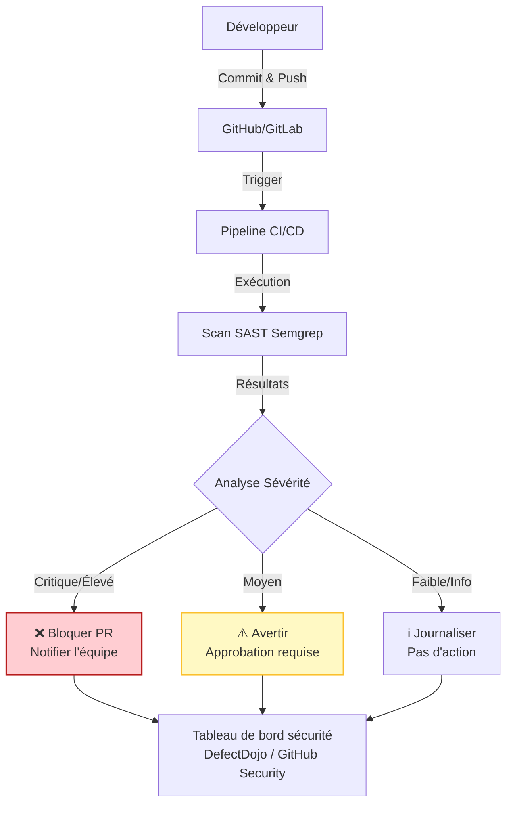

# Guide d'intégration SAST - Phase d'implémentation

## Vue d'ensemble

**Les tests de sécurité statiques d'application (SAST)** analysent le code source pour détecter des vulnérabilités de sécurité sans exécuter l'application.

**Avantages** :
- Détection précoce (sécurité shift-left)
- Peu de faux positifs pour les vulnérabilités courantes (injection SQL, XSS, secrets codés en dur)
- Exécution automatique en CI/CD
- Fournit des conseils ligne par ligne

---

## 1. Sélection de l'outil

| Outil | Support des langages | Avantages | Inconvénients | Coût |
|------|------------------|------|------|------|
| **Semgrep** | 30+ langages | Rapide, règles personnalisables, peu de faux positifs | Support commercial limité | Gratuit (OSS) / Payant (Team) |
| **SonarQube** | 25+ langages | Complet, qualité + sécurité, fonctionnalités entreprise | Configuration lourde, quelques faux positifs | Gratuit (Community) / Payant (Enterprise) |
| **Checkmarx** | 25+ langages | Niveau entreprise, rapports détaillés | Coûteux, scans plus lents | Commercial |
| **Snyk Code** | 10+ langages | Rapide, adapté aux développeurs, bonnes intégrations | Support de langages limité | Gratuit (limité) / Payant |
| **GitHub CodeQL** | 10+ langages | Gratuit pour dépôts publics, intégration GitHub | Limité à GitHub | Gratuit (public) / Payant (privé) |

**Recommandé pour ce projet** : ☑ Semgrep (rapide, personnalisable, gratuit)

---

## 2. Architecture d'intégration



---

## 3. Implémentation (Semgrep + GitHub Actions)

### Workflow GitHub Actions

`.github/workflows/sast-scan.yml` :

```yaml
name: Scan SAST de sécurité

on:
  pull_request:
    branches: [main, develop]
  push:
    branches: [main]
  schedule:
    - cron: '0 2 * * 1' # Scan complet hebdomadaire (lundis à 2h)

jobs:
  semgrep:
    name: Scan SAST Semgrep
    runs-on: ubuntu-latest

    container:
      image: returntocorp/semgrep

    steps:
      - name: Récupérer le code
        uses: actions/checkout@v4

      - name: Exécuter le scan Semgrep
        run: |
          semgrep scan \
            --config auto \
            --config p/owasp-top-ten \
            --config p/cwe-top-25 \
            --sarif -o semgrep-results.sarif \
            --error \
            --metrics=off

      - name: Téléverser les résultats SARIF vers GitHub Security
        uses: github/codeql-action/upload-sarif@v2
        if: always()
        with:
          sarif_file: semgrep-results.sarif

      - name: Vérifier les découvertes bloquantes
        run: |
          # Échouer le build si découvertes critiques ou de sévérité élevée
          CRITICAL=$(jq '.runs[0].results[] | select(.level=="error") | .ruleId' semgrep-results.sarif | wc -l)

          if [ $CRITICAL -gt 0 ]; then
            echo "❌ Trouvé $CRITICAL découvertes de sévérité critique/élevée"
            echo "Consultez les résultats dans l'onglet GitHub Security"
            exit 1
          fi

          echo "✅ Aucune découverte de sécurité bloquante"
```

---

## 4. Configuration des règles Semgrep

Créer `.semgrep.yml` :

```yaml
rules:
  - id: hardcoded-api-key
    pattern: |
      API_KEY = "..."
    message: Clé API codée en dur détectée
    severity: ERROR
    languages: [python, javascript]

  - id: sql-injection-risk
    pattern: |
      db.execute($QUERY)
    message: Risque d'injection SQL - utilisez des requêtes paramétrées
    severity: WARNING
    languages: [python]

  - id: no-eval
    pattern: eval(...)
    message: L'utilisation de eval() est dangereuse
    severity: ERROR
    languages: [javascript, python]
```

---

## 5. Politique : Quand bloquer les PRs

| Sévérité | Action | Justification |
|----------|--------|-----------|
| **Critique** | ❌ Bloquer PR | Injection SQL, RCE, contournement d'authentification |
| **Élevé** | ❌ Bloquer PR | XSS, secrets codés en dur, mauvaise utilisation crypto |
| **Moyen** | ⚠️ Avertir, autoriser avec approbation | Moins critique mais devrait être corrigé |
| **Faible** | ℹ️ Info uniquement | Qualité du code, problèmes mineurs |

---

## 6. Workflow développeur

1. Le développeur écrit du code localement
2. **Optionnel** : Exécuter `semgrep --config auto .` localement avant le commit
3. Commit et push vers la branche feature
4. Créer PR → Le scan SAST s'exécute automatiquement
5. Si bloqué : Corriger les problèmes, push à nouveau
6. Si réussi : PR approuvée et fusionnée

---

## 7. Gestion des faux positifs

**Supprimer les faux positifs** :

```python
# nosemgrep: python.lang.security.audit.dangerous-eval.dangerous-eval-use
eval(safe_expression) # Vérifié sûr - accepte uniquement les expressions mathématiques
```

**Documenter les suppressions** dans les commentaires du code avec la justification.

---

## 8. Métriques et rapports

Suivre :
- Total des découvertes par scan
- Découvertes par sévérité
- Temps de correction (temps moyen de remédiation)
- Tendance dans le temps (amélioration ou dégradation)

**Tableau de bord** : Onglet GitHub Security / DefectDojo

---

## 9. Checklist d'implémentation

- [ ] Sélectionner l'outil SAST (Semgrep recommandé)
- [ ] Ajouter le workflow SAST au CI/CD (.github/workflows/sast-scan.yml)
- [ ] Configurer les ensembles de règles (auto, OWASP Top 10, CWE Top 25)
- [ ] Définir la politique de blocage (Critique/Élevé = bloquer PR)
- [ ] Tester le workflow avec du code vulnérable connu
- [ ] Former l'équipe à la lecture des résultats SAST
- [ ] Documenter le processus de suppression des faux positifs
- [ ] Configurer le tableau de bord sécurité (optionnel)

---

## Ressources associées

- [Guide d'intégration DAST](dast-integration-guide-implementation.md)
- [Guide d'intégration SCA](sca-dependency-scanning.md)
- [Documentation Semgrep](https://semgrep.dev/docs/)
- [OWASP SAST](https://owasp.org/www-community/Source_Code_Analysis_Tools)
