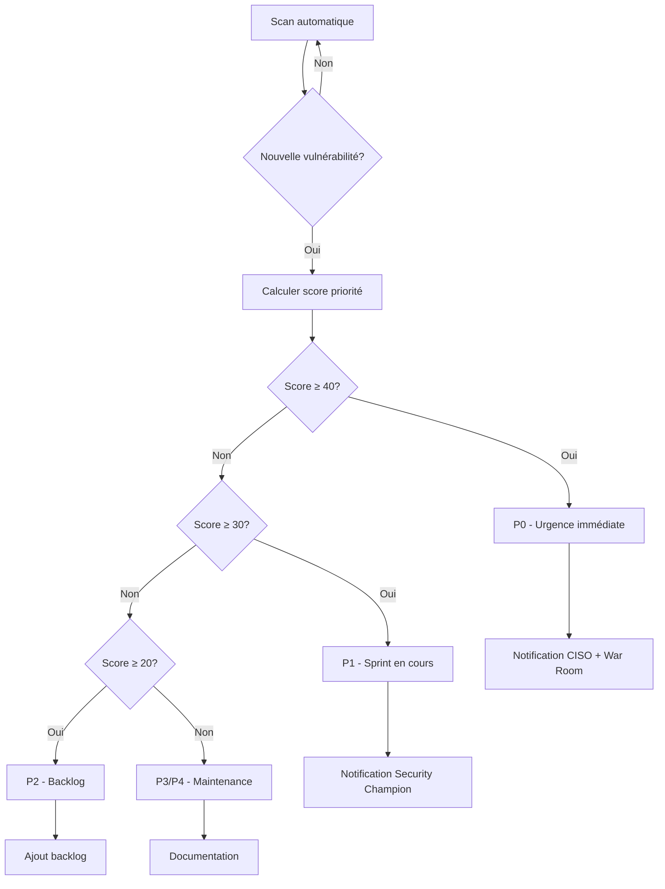

# Matrice de priorisation des vulnérabilités

## Objectif

Fournir un cadre de décision pour prioriser les vulnérabilités à corriger en fonction de multiples facteurs, au-delà du simple score CVSS.

**Principe** : Toutes les vulnérabilités ne se valent pas. Prioriser intelligemment permet d'allouer les ressources là où le risque est maximum.

---

## 1. Facteurs de priorisation

### Facteur 1 : Criticité intrinsèque (CVSS Score)

| Score CVSS | Niveau | Points |
|------------|--------|--------|
| 9.0 - 10.0 | Critical | 10 |
| 7.0 - 8.9  | High | 7 |
| 4.0 - 6.9  | Medium | 4 |
| 0.1 - 3.9  | Low | 1 |

**Source** : https://nvd.nist.gov/vuln/detail/CVE-XXXX-XXXXX

---

### Facteur 2 : Exploitabilité (EPSS Score)

**EPSS (Exploit Prediction Scoring System)** : Probabilité qu'une vulnérabilité soit exploitée dans les 30 prochains jours.

| EPSS Score | Probabilité | Points |
|------------|-------------|--------|
| > 75% | Très élevée (exploit public, attaques actives) | 10 |
| 50-75% | Élevée (exploit public disponible) | 7 |
| 25-50% | Moyenne (PoC disponible) | 4 |
| < 25% | Faible (pas d'exploit connu) | 1 |

**Source** : https://www.first.org/epss/

**Exemples** :
- Log4Shell (CVE-2021-44228) : EPSS > 90%
- Bibliothèque obscure : EPSS < 5%

---

### Facteur 3 : Exposition de l'asset

| Exposition | Description | Points |
|----------|-------------|--------|
| **Publique Internet** | API publique, site web, endpoint exposé | 10 |
| **Semi-publique** | VPN, partenaires, clients B2B | 7 |
| **Interne** | Réseau interne, backend | 4 |
| **Isolée** | Dev/test, pas en production | 1 |

---

### Facteur 4 : Sensibilité des données

| Type de données | Exemples | Points |
|----------------|----------|--------|
| **Très sensible** | Données de paiement (PCI-DSS), secrets (API keys) | 10 |
| **Sensible** | Données personnelles (RGPD), données santé (HIPAA) | 7 |
| **Confidentiel** | Données métier internes, propriété intellectuelle | 4 |
| **Public** | Données publiques, marketing | 1 |

---

### Facteur 5 : Criticité business de l'asset

| Criticité | Description | Points |
|-----------|-------------|--------|
| **Mission-critical** | Panne = perte revenue directe (paiement, auth) | 10 |
| **Important** | Impact utilisateurs mais workaround possible | 7 |
| **Secondaire** | Impact limité, services non essentiels | 4 |
| **Nice-to-have** | Features optionnelles, outils internes | 1 |

---

## 2. Calcul du score de priorité

### Formule

```
Score Total = (CVSS Points) + (EPSS Points) + (Exposition Points) +
               (Sensibilité Points) + (Criticité Business Points)

Score Maximum = 50 points
```

### Matrice de priorité

| Score Total | Priorité | SLA | Action |
|-------------|----------|-----|--------|
| 40-50 | **P0 - Urgent** | 24-48h | Procédure d'urgence, war room |
| 30-39 | **P1 - Haute** | 7 jours | Sprint en cours, tests rapides |
| 20-29 | **P2 - Moyenne** | 30 jours | Backlog, tests standards |
| 10-19 | **P3 - Basse** | 90 jours | Maintenance planifiée |
| 0-9 | **P4 - Info** | Best effort | Documentation, pas de patch urgent |

---

## 3. Exemples de priorisation

### Exemple 1 : Vulnérabilité critique sur API publique

**Contexte** :
- CVE-2024-12345 dans une bibliothèque JSON
- API de paiement publique
- CVSS 9.2 (Critical)
- Exploit public disponible (EPSS 85%)

**Calcul** :
```
CVSS (9.2)              : 10 points (Critical)
EPSS (85%)              : 10 points (Très élevée)
Exposition              : 10 points (Publique Internet)
Sensibilité données     : 10 points (Paiement PCI-DSS)
Criticité business      : 10 points (Mission-critical)
────────────────────────────────────
TOTAL                   : 50 points
```

**Résultat** : **P0 - Urgent** → Procédure d'urgence, patch sous 24-48h

---

### Exemple 2 : Vulnérabilité moyenne sur outil interne

**Contexte** :
- CVE-2024-67890 dans un dashboard admin interne
- CVSS 6.5 (Medium)
- Pas d'exploit public (EPSS 5%)

**Calcul** :
```
CVSS (6.5)              : 4 points (Medium)
EPSS (5%)               : 1 point (Faible)
Exposition              : 4 points (Interne)
Sensibilité données     : 4 points (Confidentiel)
Criticité business      : 4 points (Secondaire)
────────────────────────────────────
TOTAL                   : 17 points
```

**Résultat** : **P3 - Basse** → Maintenance planifiée, patch sous 90 jours

---

### Exemple 3 : Vulnérabilité critique mais non exploitable

**Contexte** :
- CVE-2024-11111 dans une bibliothèque de logs
- CVSS 8.9 (High)
- Pas d'exploit (EPSS 2%)
- Code vulnérable non utilisé (dead code)

**Calcul** :
```
CVSS (8.9)              : 7 points (High)
EPSS (2%)               : 1 point (Faible)
Exposition              : 4 points (Interne)
Sensibilité données     : 1 point (Logs publics)
Criticité business      : 4 points (Secondaire)
────────────────────────────────────
TOTAL                   : 17 points
```

**Résultat** : **P3 - Basse** → Malgré CVSS High, priorisation basse car non exploitable

**Note** : Possibilité de "accept risk" si code mort + effort de migration trop important

---

## 4. Matrice décisionnelle visuelle

```
                           CVSS Score
                 Low (1-3.9)  Med (4-6.9)  High (7-8.9)  Crit (9-10)
               ┌────────────┬────────────┬────────────┬────────────┐
Exploit Public │            │            │            │            │
   + Publique  │     P2     │     P1     │     P0     │     P0     │
               ├────────────┼────────────┼────────────┼────────────┤
Exploit Public │            │            │            │            │
   + Interne   │     P3     │     P2     │     P1     │     P0     │
               ├────────────┼────────────┼────────────┼────────────┤
Pas d'exploit  │            │            │            │            │
   + Publique  │     P3     │     P2     │     P1     │     P1     │
               ├────────────┼────────────┼────────────┼────────────┤
Pas d'exploit  │            │            │            │            │
   + Interne   │     P4     │     P3     │     P2     │     P2     │
               └────────────┴────────────┴────────────┴────────────┘
```

---

## 5. Cas particuliers

### Cas 1 : Dépendance transitive non patchable

**Problème** : Vulnérabilité dans une sous-dépendance, pas de version fixée disponible.

**Décision** :
1. **Vérifier reachability** : Le code vulnérable est-il appelé ?
   ```bash
   # Exemple avec Snyk
   snyk test --reachable-vulns
   ```

2. **Si non atteignable** : Accepter le risque temporairement
   - Documenter dans `.snyk` ou `audit-ignore`
   - Réévaluer mensuellement

3. **Si atteignable** :
   - **P0/P1** : Fork + patch manuel ou workaround code
   - **P2/P3** : Override de version (risk accepted)

---

### Cas 2 : Vulnérabilité dans service legacy

**Problème** : Service ancien en fin de vie, effort de patch très élevé.

**Décision matrix** :

| Service actif ? | Données sensibles ? | Décision |
|----------------|---------------------|----------|
| Oui | Oui | **Patcher** (P0/P1) ou isoler réseau |
| Oui | Non | **Mitigation** (WAF, firewall) + plan de décommission |
| Non | - | **Décommissionner** immédiatement |

---

### Cas 3 : Faux positif

**Problème** : Scanner détecte une vulnérabilité mais analyse manuelle confirme que c'est un faux positif.

**Actions** :
1. Documenter l'analyse dans un ticket
2. Ajouter à la liste d'exclusion du scanner
3. Informer le vendor du scanner (Snyk, Dependabot)

**Template de documentation** :
```markdown
## Faux Positif : [EXAMPLE: CVE-2024-12345]

**Scanner** : Snyk
**Composant** : library-x v1.2.3
**Raison faux positif** :
- Vulnérabilité nécessite configuration Y
- Notre code utilise configuration Z (pas vulnérable)

**Validation** :
- [x] Code review effectué
- [x] Tests de sécurité passés
- [x] Approuvé par Security Champion

**Action** : Ajouté à .snyk ignore
```

---

## 6. Workflow de triage

### Processus hebdomadaire



---

### Réunion de triage (1h/semaine)

**Participants** : Security Champion, Tech Lead, Product Manager

**Agenda** :
1. Review des nouvelles vulnérabilités de la semaine
2. Calcul des scores de priorité (tableau ci-dessous)
3. Assignation des responsables
4. Mise à jour du registre des vulnérabilités

**Durée** : Max 1h

---

## 7. Registre des vulnérabilités

### Template de registre

| CVE | CVSS | EPSS | Expo | Data | Biz | **Total** | **Priorité** | Assigné | Deadline | Statut |
|-----|------|------|------|------|-----|-----------|--------------|---------|----------|--------|
| CVE-2024-001 | 10 | 10 | 10 | 10 | 10 | **50** | P0 | John | 2024-12-02 | ⏳ En cours |
| CVE-2024-002 | 7 | 7 | 10 | 7 | 7 | **38** | P1 | Jane | 2024-12-08 | ⏳ En cours |
| CVE-2024-003 | 4 | 1 | 4 | 4 | 4 | **17** | P3 | Mike | 2025-01-15 | 📋 Backlog |
| CVE-2024-004 | 7 | 1 | 1 | 1 | 1 | **11** | P4 | - | Best effort | 📝 Info |

**Légende** :
- ⏳ En cours
- ✅ Corrigée
- 📋 Backlog
- 📝 Info (pas d'action requise)
- ❌ Accepté (risk accepted)

---

## 8. Outils de priorisation

### Outils automatisés

**Snyk Priority Score** :
```bash
snyk test --priority-score
# Output inclut le score de priorité automatique
```

**CVSS Calculator** :
- https://www.first.org/cvss/calculator/3.1
- https://nvd.nist.gov/vuln-metrics/cvss/v3-calculator

**EPSS API** :
```bash
curl https://api.first.org/data/v1/epss?cve=CVE-2021-44228
```

---

## 9. Checklist de validation

- [ ] Facteurs de priorisation définis (CVSS, EPSS, Exposition, Données, Business)
- [ ] Formule de calcul documentée
- [ ] Matrice de priorité validée par l'équipe
- [ ] Processus de triage hebdomadaire établi
- [ ] Registre des vulnérabilités mis en place
- [ ] Responsables assignés pour chaque priorité
- [ ] Outils de calcul automatique configurés

---

## 10. Exemples de décisions

### Décision 1 : Accepter le risque

**Contexte** :
- Vulnérabilité MEDIUM (CVSS 5.5)
- Service en fin de vie (décommission dans 2 mois)
- Pas d'exploit public
- Réseau interne uniquement

**Score** : 13 points (P3)

**Décision** : **Accepter le risque**
- Documenter dans le registre des risques
- Monitoring renforcé
- Décommission accélérée si possible

---

### Décision 2 : Mitigation temporaire

**Contexte** :
- Vulnérabilité CRITICAL (CVSS 9.8)
- Pas de patch disponible
- API publique

**Score** : 48 points (P0)

**Décision** : **Mitigation immédiate**
- Règle WAF activée (bloquer exploit pattern)
- Restriction IP temporaire
- Patch dès disponible

---

### Décision 3 : Décommissionner

**Contexte** :
- Vulnérabilité HIGH dans service legacy
- Coût de patch > Coût de décommission
- Service peu utilisé (< 100 requêtes/jour)

**Score** : 35 points (P1)

**Décision** : **Décommissionner sous 7 jours**
- Migration utilisateurs vers nouveau service
- Désactivation du service vulnérable

---

## Ressources

- [CVSS v3.1 Specification](https://www.first.org/cvss/v3.1/specification-document)
- [EPSS (Exploit Prediction Scoring System)](https://www.first.org/epss/)
- [CISA Known Exploited Vulnerabilities](https://www.cisa.gov/known-exploited-vulnerabilities-catalog)
- [OWASP Risk Rating Methodology](https://owasp.org/www-community/OWASP_Risk_Rating_Methodology)

---

**Prochaine étape** : Définir les SLA avec [patch-sla-policy-template.md](patch-sla-policy-template.md)
