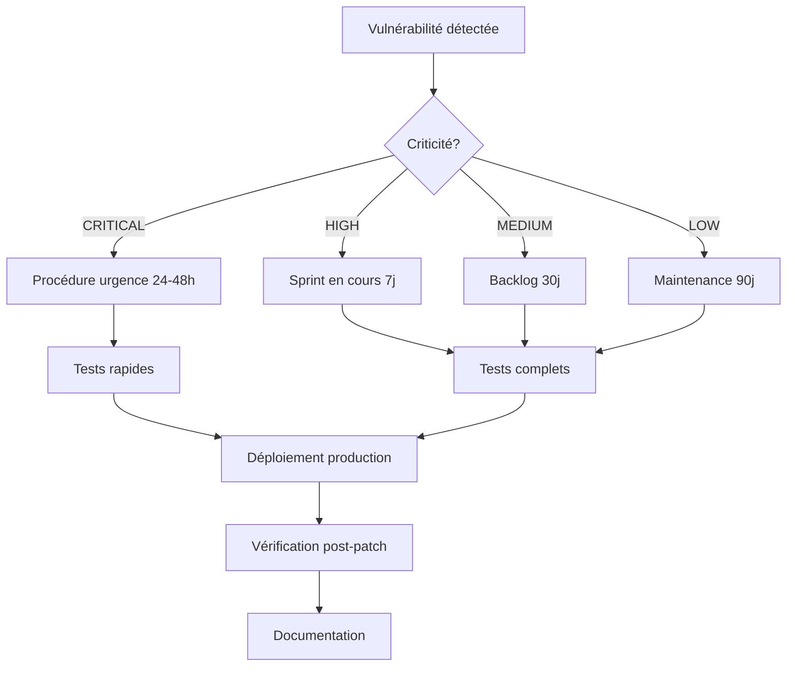

# Politique de SLA pour les correctifs de sécurité

## Métadonnées du projet

**Projet** : [Nom du projet]
**Date de création** : [AAAA-MM-JJ]
**Responsable** : [Nom du security champion]
**Dernière révision** : [AAAA-MM-JJ]
**Version** : 1.0.0

---

## Objectif

Définir les délais maxim aux (SLA) pour appliquer les correctifs de sécurité selon la criticité des vulnérabilités.

**Principe** : Un patch non appliqué est une porte ouverte aux attaquants. Les SLA garantissent une réponse rapide et proportionnée.

---

## 1. Classification des vulnérabilités

### Niveau CRITICAL (CVSS 9.0-10.0)

**Caractéristiques** :
- Exploitation triviale (exploit public disponible)
- Impact catastrophique (RCE, perte totale de confidentialité)
- Exploitable à distance sans authentification
- Attaques actives observées dans la nature

**Exemples** :
- Log4Shell (CVE-2021-44228) - CVSS 10.0
- Heartbleed (CVE-2014-0160) - CVSS 7.5 mais impact critical
- Apache Struts RCE (CVE-2017-5638) - CVSS 10.0

**SLA de correction** : **24-48 heures**

**Actions obligatoires** :
- [ ] Notification immédiate au CISO/Direction
- [ ] Activation de la procédure d'urgence
- [ ] Patch appliqué en production sous 48h maximum
- [ ] Vérification post-patch immédiate
- [ ] Communication aux parties prenantes

---

### Niveau HIGH (CVSS 7.0-8.9)

**Caractéristiques** :
- Exploitation possible mais nécessite certaines conditions
- Impact élevé (injection SQL, XSS stored, privilege escalation)
- Exploitable à distance avec authentification

**Exemples** :
- SQL Injection dans une API publique
- XSS stored dans une application web
- IDOR permettant l'accès aux données utilisateurs

**SLA de correction** : **7 jours**

**Actions obligatoires** :
- [ ] Notification au security champion
- [ ] Planification du patch dans le sprint en cours
- [ ] Patch appliqué en production sous 7 jours
- [ ] Tests de non-régression avant déploiement
- [ ] Communication interne

---

### Niveau MEDIUM (CVSS 4.0-6.9)

**Caractéristiques** :
- Exploitation complexe ou conditions spécifiques requises
- Impact modéré (information disclosure, DoS)
- Exploitable localement ou avec privilèges

**Exemples** :
- Reflected XSS nécessitant interaction utilisateur
- Information disclosure limitée (version serveur exposée)
- DoS nécessitant des ressources importantes

**SLA de correction** : **30 jours**

**Actions obligatoires** :
- [ ] Ajout au backlog de sécurité
- [ ] Planification dans un prochain sprint
- [ ] Patch appliqué en production sous 30 jours
- [ ] Tests standards avant déploiement

---

### Niveau LOW (CVSS 0.1-3.9)

**Caractéristiques** :
- Exploitation très complexe ou impact négligeable
- Require accès physique ou privilèges élevés
- Impact cosmétique ou théorique

**Exemples** :
- Headers de sécurité manquants (sans impact réel)
- Informations de debugging exposées
- Configuration sub-optimale

**SLA de correction** : **90 jours** (ou prochaine release majeure)

**Actions obligatoires** :
- [ ] Documentation dans le registre des vulnérabilités
- [ ] Correction lors de la prochaine maintenance planifiée
- [ ] Pas de déploiement d'urgence requis

---

## 2. Facteurs d'ajustement du SLA

### Facteur 1 : Exploitabilité

| Facteur | Ajustement SLA |
|---------|----------------|
| Exploit public disponible | **-50%** (2x plus urgent) |
| Attaques actives observées | **-75%** (4x plus urgent) |
| Exploitation complexe | **+50%** (peut attendre) |
| Nécessite interaction utilisateur | **+25%** |

**Exemple** :
- Vulnérabilité HIGH (SLA 7j) + exploit public → SLA ajusté : **3-4 jours**

---

### Facteur 2 : Exposition

| Exposition | Ajustement SLA |
|------------|----------------|
| Endpoint public internet | **-25%** |
| API publique | **-25%** |
| Backend interne uniquement | **+50%** |
| Environnement de développement | **+100%** |

**Exemple** :
- Vulnérabilité MEDIUM (SLA 30j) sur API interne → SLA ajusté : **45 jours**

---

### Facteur 3 : Données sensibles

| Type de données | Ajustement SLA |
|-----------------|----------------|
| Données de paiement (PCI-DSS) | **-50%** |
| Données personnelles (RGPD) | **-25%** |
| Données publiques | **+25%** |
| Pas de données (service stateless) | **+50%** |

**Exemple** :
- Vulnérabilité HIGH (SLA 7j) sur service de paiement → SLA ajusté : **3-4 jours**

---

## 3. Exceptions et dérogations

### Cas d'exception acceptables

**Exception 1 : Patch non disponible**
- Vendor n'a pas encore publié de patch
- **Action** : Mitigation temporaire (WAF rule, désactivation feature)
- **SLA** : Appliquer mitigation sous **24h**, patch dès disponible

**Exception 2 : Breaking changes majeures**
- Patch nécessite upgrade majeur (ex: PHP 7 → PHP 8)
- **Action** : Planification d'upgrade + mitigation temporaire
- **SLA** : Mitigation sous **48h**, upgrade dans **30 jours**

**Exception 3 : Dépendance transitive non patchable**
- Vulnérabilité dans une sous-dépendance
- Pas de version compatible disponible
- **Action** : Override/fork temporaire + monitoring
- **SLA** : Override sous **7 jours**, réévaluation mensuelle

---

### Processus de demande de dérogation

**Qui peut demander** : Tech Lead, Security Champion, CTO

**Justifications acceptables** :
- Impact business critique (période de forte activité)
- Risque de régression très élevé
- Ressources insuffisantes (équipe réduite, vacances)

**Procédure** :
1. Documenter la dérogation dans un ticket
2. Proposer une mitigation alternative
3. Obtenir l'approbation du CISO/Security Champion
4. Définir une nouvelle deadline (max +50% du SLA)
5. Réévaluer hebdomadairement

**Template de demande** :

```markdown
## Demande de dérogation de SLA

**Vulnérabilité** : [EXAMPLE: CVE-2024-12345]
**SLA normal** : 7 jours
**Nouvelle deadline demandée** : 14 jours

**Justification** :
[Expliquer pourquoi le SLA ne peut pas être respecté]

**Mitigation temporaire** :
- [ ] WAF rule activée
- [ ] Monitoring renforcé
- [ ] Restriction d'accès temporaire

**Plan de correction** :
- [AAAA-MM-JJ] : Tests en staging
- [AAAA-MM-JJ] : Déploiement production

**Approbation** : [CISO/Security Champion]
```

---

## 4. Processus de patch

### Workflow standard



---

### Checklist avant patch

**Phase 1 : Évaluation (Jour 0)** :
- [ ] CVSS score vérifié
- [ ] Exploitabilité évaluée (exploit public ?)
- [ ] Impact métier évalué
- [ ] SLA déterminé (avec ajustements)
- [ ] Parties prenantes notifiées

**Phase 2 : Planification (Jour 1)** :
- [ ] Patch identifié ou mitigation définie
- [ ] Environnement de test préparé
- [ ] Fenêtre de déploiement réservée
- [ ] Rollback plan documenté

**Phase 3 : Tests (Jour 1-X)** :
- [ ] Patch appliqué en environnement de développement
- [ ] Tests de non-régression passés
- [ ] Tests de sécurité validés (vulnérabilité corrigée)
- [ ] Performance validée (pas de dégradation)
- [ ] Patch appliqué en staging

**Phase 4 : Déploiement (Jour X)** :
- [ ] Backup pré-déploiement effectué
- [ ] Patch appliqué en production
- [ ] Monitoring renforcé (1h post-déploiement)
- [ ] Vérification vulnérabilité corrigée (scan DAST/SCA)

**Phase 5 : Documentation (Jour X+1)** :
- [ ] Ticket de vulnérabilité mis à jour
- [ ] Registre des patches mis à jour
- [ ] Communication aux parties prenantes
- [ ] Retour d'expérience si incident

---

## 5. Responsabilités

| Rôle | Responsabilités |
|------|-----------------|
| **Security Champion** | Définir SLA, valider dérogations, suivre conformité |
| **Équipe DevOps** | Appliquer patches infrastructure, automatiser déploiements |
| **Développeurs** | Appliquer patches applicatifs, tester non-régression |
| **Product Manager** | Prioriser patches vs features, valider fenêtres de déploiement |
| **CISO** | Approuver dérogations critiques, escalader si SLA non respectés |

---

## 6. Métriques et reporting

### KPIs à suivre

| Métrique | Formule | Cible |
|----------|---------|-------|
| **Taux de respect SLA** | (Patches à temps / Total patches) × 100 | > 95% |
| **MTTR (Mean Time To Remediate)** | Moyenne(Date correction - Date détection) | < SLA -20% |
| **Vulnérabilités critiques en retard** | Count(Vulns CRITICAL > SLA) | 0 |
| **Âge moyen des vulnérabilités** | Moyenne(Aujourd'hui - Date détection) | < 15 jours |

---

### Reporting mensuel

**Template de rapport** :

```markdown
# Rapport de Patch Management - [Mois AAAA]

## Résumé exécutif
- **Vulnérabilités détectées** : X
- **Vulnérabilités corrigées** : Y
- **Taux de respect SLA** : Z%

## Détail par criticité

| Criticité | Détectées | Corrigées | En cours | SLA respecté |
|-----------|-----------|-----------|----------|--------------|
| CRITICAL  | 2         | 2         | 0        | 100%         |
| HIGH      | 15        | 13        | 2        | 87%          |
| MEDIUM    | 42        | 35        | 7        | 83%          |
| LOW       | 18        | 10        | 8        | 56%          |

## Vulnérabilités en retard

| CVE | Criticité | Âge (jours) | SLA | Statut | Responsable |
|-----|-----------|-------------|-----|--------|-------------|
| [EXAMPLE: CVE-2024-12345] | HIGH | 10 | 7 | Tests en cours | John Doe |

## Actions recommandées
1. [Action 1]
2. [Action 2]

**Préparé par** : [Security Champion]
**Date** : [AAAA-MM-JJ]
```

---

## 7. Audit et conformité

### Audit trimestriel

**Checklist d'audit** :
- [ ] 100% des vulnérabilités CRITICAL patchées dans SLA
- [ ] > 90% des vulnérabilités HIGH patchées dans SLA
- [ ] Toutes les dérogations documentées et approuvées
- [ ] Registre des patches à jour
- [ ] Aucune vulnérabilité > 180 jours

**Responsable** : Security Champion
**Rapport à** : CISO, Direction

---

### Non-conformité

**Conséquences si SLA non respecté** :

**1ère fois** :
- Notification au responsable
- Demande de justification
- Plan d'action sous 48h

**2ème fois** :
- Escalade au manager
- Revue de processus
- Formation équipe si nécessaire

**3ème fois** :
- Escalade à la Direction
- Audit complet du processus
- Possibles mesures disciplinaires

---

## 8. Checklist de validation

- [ ] SLA définis pour les 4 niveaux de criticité
- [ ] Facteurs d'ajustement documentés
- [ ] Processus de dérogation défini
- [ ] Workflow de patch documenté
- [ ] Responsabilités attribuées
- [ ] Métriques et KPIs définis
- [ ] Reporting mensuel configuré
- [ ] Audit trimestriel planifié
- [ ] Équipe formée aux SLA

---

## Signatures

**Créé par** : _________________________ Date : __________
**Approuvé par (Security Champion)** : _________________________ Date : __________
**Approuvé par (CISO)** : _________________________ Date : __________
**Approuvé par (Direction)** : _________________________ Date : __________

---

## Annexe : Matrice de SLA

| CVSS | Criticité | SLA Base | + Exploit public | + API publique | + Données sensibles |
|------|-----------|----------|------------------|----------------|---------------------|
| 9.0-10.0 | CRITICAL | 48h | **24h** | **36h** | **24h** |
| 7.0-8.9 | HIGH | 7j | **3-4j** | **5j** | **5j** |
| 4.0-6.9 | MEDIUM | 30j | **15j** | **22j** | **22j** |
| 0.1-3.9 | LOW | 90j | 45j | 67j | 67j |

---

**Prochaine étape** : Définir la procédure d'urgence avec [emergency-patching-procedure.md](emergency-patching-procedure.md)
